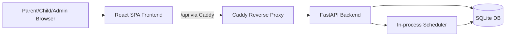
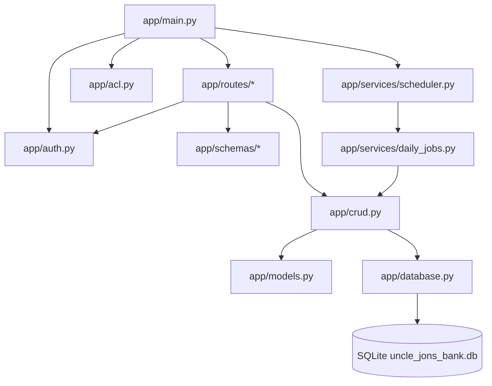
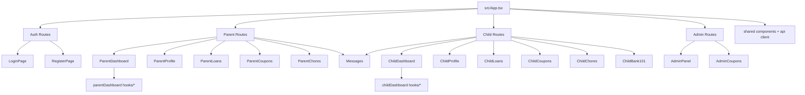

# Architecture

## System Context Diagram

## Backend Module Map

## Frontend Route And Component Map

## Notes

- Reverse proxy serves frontend at `/` and API at `/api/*`.
- Backend startup creates/updates schema and starts scheduler depending on env settings.
- Route modules are thin controllers; business logic is centralized in `app/crud.py`.
